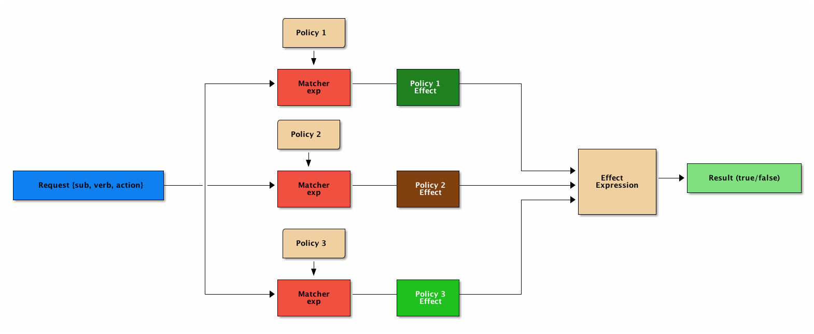

# Casbin Study
最近系统要添加RBAC功能 用的go的技术栈 当然来玩玩 Casbin啊

说到RBAC 这个玩意 就是这个用户组能干什么
- 用户
- 用户组
    - 行为
这个用户属于那个用户组 这个用户组有什么行为 能干什么

最简单实现RBAC就是使用数据库
- 用户组表
- 用户表(关联用户组)
- 行为表 

Casbin这个框架貌似比较流行 我们就来看看 他能干什么

# Casbin 窥密
- 支持多种访问控制模型
    - ACL
    - RBAC
    - ABAC
    - ...
- 多语言 (一次学习，多处运用)
我们在这里用到的版本是V2

### 基础共识
- 权限就是控制谁能对什么资源进行操作
- Casbin 基于 PERM (Policy，Effect，Request，Matchers) 元模型的配置文件
    - `policy` 策略 定义具体规则
    - `request` 访问请求抽象 `e.Enforce()` 函数一一对应
    - `matcher` 匹配器 会将请求与定义的每一个`policy`一一匹配 生成多个匹配结果
    - `effect` 根据对请求运用匹配器得出所有结果进行汇总 来决定该请求是允许还是拒绝



### 举一个🌰栗子(此处应该有三只松鼠，顺便把广告费结一下) [demo1]
- 首先编写模型
```editorconfig
[request_definition]
r=sub,obj,act

[policy_definition]
p=sub,obj,act

[matchers]
m=r.sub==p.sub&&r.obj==p.obj&&r.act==p.act

[policy_effect]
e=some(where(p.eft==allow))
```
上面模型文件规定了权限由`sub,obj,act`三要素组成,只有在策略列表中有它完全相同的策略时

改请求才能通过。匹配可以通过`p.eft`获取,

`some(where(p.eft==allow))`表示只要有一条策略允许即可

然后我们策略文件(即谁对资源进行什么操作): 
```csv
p,dajun,data1,read
p,lizi,data2,write
```
上面`csv`文件的两行内容表示`dajun`对数据`data1`有`read`权限，`lizi`对数据`data2`有`write`权限。
code:
```go
package main

import (
	"github.com/casbin/casbin/v2"
	"log"
)

func check(e *casbin.Enforcer,sub,obj,act string) {
	enforce, err := e.Enforce(sub, obj, act)
	if err != nil {
		log.Fatalln("check error: ",err)
	}

	if enforce {
		log.Printf("%s %s %s SUCCESS \n",sub,obj,act)
	}else {
		log.Printf("%s %s %s ERROR \n",sub,obj,act)
	}
}

func main() {
	enforcer, err := casbin.NewEnforcer("./model.conf", "./policy.csv")
	if err != nil {
		log.Fatalln("new enforcer err: ",err)
	}

	check(enforcer, "user1", "data1", "read")
	check(enforcer, "user2", "data2", "write")
	check(enforcer, "user1", "data1", "write")
	check(enforcer, "user2", "data2", "read")
}
```
请求必须完全匹配某条策略才能通过。`("dajun", "data1", "read")`匹配p,
`dajun, data1, read，("lizi", "data2", "write")`匹配p, 
`lizi, data2, write，`所以前两个检查通过。第 3 个因为`"dajun"`没有对data1的write权限，
第 4 个因为dajun对data2没有read权限，所以检查都不能通过。输出结果符合预期。

`sub/obj/act`依次对应传给Enforce方法的三个参数。
实际上这里的`sub/obj/act`和`read/write/data1/data2`是我自己随便取的，
你完全可以使用其它的名字，只要能前后一致即可。

上面例子中实现的就是ACL（access-control-list，访问控制列表）。
ACL显示定义了每个主体对每个资源的权限情况，未定义的就没有权限。
我们还可以加上超级管理员，超级管理员可以进行任何操作。假设超级管理员为root，
我们只需要修改匹配器：
```editorconfig
[matchers]
e = r.sub == p.sub && r.obj == p.obj && r.act == p.act || r.sub == "root"
```

## RBAC + Casbin  (role-based-access-control） [demo2]
`ACL`模型在用户和资源都比较少的情况下没什么问题，但是用户和资源量一大，
`ACL`就会变得异常繁琐。想象一下，每次新增一个用户，都要把他需要的权限重新设置一遍是多么地痛苦。
`RBAC`（role-based-access-control）模型通过引入角色（`role`）这个中间层来解决这个问题。
每个用户都属于一个角色，例如开发者、管理员、运维等，每个角色都有其特定的权限，
权限的增加和删除都通过角色来进行。这样新增一个用户时，我们只需要给他指派一个角色，
他就能拥有该角色的所有权限。修改角色的权限时，属于这个角色的用户权限就会相应的修改。
```editorconfig
[request_definition]
r = sub, obj, act

[policy_definition]
p = sub, obj, act

[role_definition]
g = _, _  # 用户组关系  a,b a用户 属于 用户组b  

[matchers]
m = r.sub == p.sub && r.obj == p.obj && r.act == p.act
m = g(r.sub, p.sub) && r.obj == p.obj && r.act == p.act

[policy_effect]
e = some(where (p.eft == allow))  # 只要一个通过就都通过
```
csv:
```csv
p,admin,data1,read
p,admin,data1,write
p,admin,data2,write
p,admin,data2,read

p,developer,data1,read

g,he1,admin  # he1属于 admin
g,he2,developer
```
### RBACs 
```editorconfig 
[role_definition]
g = _, _  
g2 = _, _ # 新增一个 资源组

[matchers]
m = g(r.sub, p.sub) && (r.obj, p.obj) && r.act == p.act
```
csv
```csv
p,admin,prod,read
p,admin,prod,write
p,admin,dev,read
p,admin,dev,write

p,developer,dev,read
p,developer,dev,write
p,developer,dev,read

g,user1,admin
g,user2,develper

g2,prod.data,prod
g2,dev.data,dev
```
### RBAC domain
- domain 领域
- tenant 租户
```editorconfig
[request_definition]
r = sub, dom, obj, act

[policy_definition]
p = sub, dom, obj, act

[role_definition]
g = _, _ , _

[policy_effect]
e = some(where (p.eft == allow))

[matchers]
m = g( r.sub, p.sub, r.dom ) && r.dom == p.dom && r.obj == p.obj && r.act == p.act
```
csv
```csv 
p, admin, tenant1, data1, read
p, admin, tenant2, data2, read
g, user1, admin, tenant1
g, user2, developer, tenant2
```

### ABAC 动态的RBAC (ARAC笔RBAC更加细致 比如 规定一个时间区域内A用户有对资源B读的权限)
```editorconfig 
[request_definition]
r = sub, obj, act

[policy_definition]
p = sub, obj, act

[matchers]
m = r.sub.Hour >= 9 && r.sub.Hour < 18 || r.sub.Name == r.obj.Owner

[policy_effect]
e = some(where (p.eft == allow))
```
```go
type Object struct {
  Name  string
  Owner string
}

type Subject struct {
  Name string
  Hour int
}

func check(e *casbin.Enforcer, sub Subject, obj Object, act string) {
    ok, err := e.Enforce(sub, obj, act)
    if err != nil {
        log.Fatalln("check error: ",err)
    }
    
    if enforce {
        log.Printf("%s %s %s SUCCESS \n",sub,obj,act)
    }else {
        log.Printf("%s %s %s ERROR \n",sub,obj,act)
    }
}

func main() {
  e, err := casbin.NewEnforcer("./model.conf", "./policy.csv")
  if err != nil {
  	log.Fatalln(err)
  }

  o := Object{"data", "user1"}
  s1 := Subject{"user1", 10}
  check(e, s1, o, "read")

  s2 := Subject{"user2", 10}
  check(e, s2, o, "read")

  s3 := Subject{"user1", 20}
  check(e, s3, o, "read")

  s4 := Subject{"user2", 20}
  check(e, s4, o, "read")
}
```
